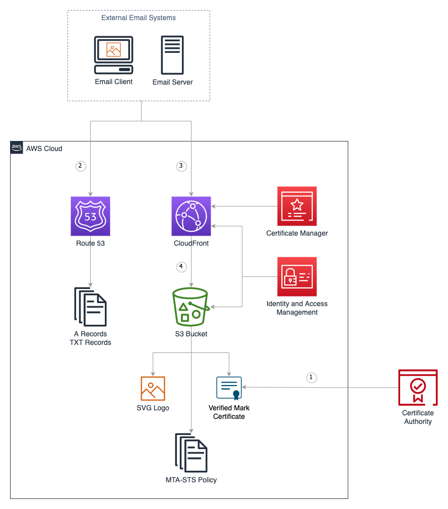

# AWS-Hosted Records and Files for MTA-STS, TLS-RPT, and BIMI

## Overview

As an email domain owner, you will gain security benefits, increase visibility, and improve the perception of your domain’s brand by implementing some industry-standard mechanisms in your AWS environment. 

- Mail Transfer Agent Strict Transport Security (MTA-STS) helps ensure that email servers always use encryption and certificate-based authentication when sending you email to ensure there are no eavesdroppers in the communication across the internet. 
- Simple Mail Transfer Protocol (SMTP) Transport Layer Security Reporting (TLS-RPT) reports contain information valuable for you to monitor your overall security posture, identify problems, and learn about attacks that may be occurring.
- Brand Indicators for Message Identification (BIMI) causes your organization’s logo is displayed to recipients in their email inboxes. BIMI lets your organization visually authenticate messages, by publishing a logo for supporting mail providers to display with the message in the Inbox.

When external systems decide whether and how to send email to and receive from your email domains they look in the Domain Name System (DNS) for specific records that you have published in [Amazon Route 53](https://aws.amazon.com/route53/). In some cases, the DNS record will reference an HTTPS link to additional information which you can host in [Amazon Simple Storage Service (S3)](https://aws.amazon.com/s3/), delivered via [Amazon CloudFront](https://aws.amazon.com/cloudfront/), and secured with a certificate provisioned from [Amazon Certificate Manager (ACM)](https://aws.amazon.com/certificate-manager/). 

Deploy this solution to have the appropriate DNS records and web hosting content deployed into your AWS account for the email security policies outlined in this blog.

> **Note** You can implement this AWS solution regardless of where you host inbound email for your domain(s), regardless of which services you use to send email, and regardless of where you host DNS. For purposes of clarity, this blog will assume that you are using Route 53 for DNS. If you use a different DNS hosting provider you will manually configure DNS records in your existing hosting provider.

## 2. Architecture

The architecture for this solution is depicted in the following diagram. 



1. As described in the BIMI section of this blog post, the Verified Mark Certificate is obtained from a BIMI-qualified Certificate Authority and stored in the S3 bucket.
2. When an external email system receives a message claiming to be from your domain, it looks up records for your domain in DNS. As depicted in the diagram, a DNS request is sent to Route 53. If the domain’s DNS is hosted elsewhere, the records need to be published manually.
3. The external email system will make HTTPS requests to CloudFront, which has a TLS certificate provisioned with Amazon Certificate Manager.
4. The web content is hosted in an S3 bucket, and CloudFront has access to this bucket via an [Origin Access Identity](https://docs.aws.amazon.com/AmazonCloudFront/latest/DeveloperGuide/private-content-restricting-access-to-s3.html), which is a mechanism of [AWS Identity and Access Management (IAM)](https://aws.amazon.com/iam/)

### 2.1 AWS Services

The solution uses the following AWS services:

| Service | Function |
| --- | --- |
| Route 53 | Hosting of DNS records
| S3 | Storage of files and access logs
| CloudFront | Web hosting
| Certificate Manager | TLS certificate for CloudFront
| Identity and Access Management | Origin access identity for CloudFront to access S3

## 3. Prerequisites

- DNS hosted zone
- CDK 2.17.0 or later installed locally
- CDK v2 bootstrap deployed in the target account (via `cdk bootstrap`)

### BIMI Requirements

- DMARC policy of `p=quarantine` or `p=reject`
- Valid BIMI image
- (Optional) Verified mark certificate issued by a third-party certificate authority

## 4. Configuration Settings

- Update `CONFIG.py` to reflect your desired settings.
  - If no verified mark certificate is provided, set `VMC_FILENAME = None`
  - If your DNS zone is not hosted in Route 53, or if you do not want this app to manage Route 53 DNS records, set `ROUTE_53_HOSTED = False`. In this case, you will need to set `TLS_CERTIFICATE_ARN` to the ARN of a certificate hosted in AWS Certificate Manager in `us-east-1`. This certificate will be used by CloudFront and must support two subdomains: `mta-sts` and your configured `BIMI_ASSET_SUBDOMAIN`.
- Place your BIMI logo and verified mark certificate files in the `assets` folder.
- Create an MTA-STS policy file at `assets/.well-known/mta-sts.txt` to reflect your MX servers and policy requirements. If this file is not present when the application is synthesized, one will be automatically created using the domain's MX records and the configured `MTA_STS_MODE`.

> **Note**: If your Route 53 hosted zone has existing A or TXT records for BIMI, MTA-STS, or TLS-RPT that you would like this app to manage, the existing records must be removed before deployment.

## 5. Deployment

1. Open a terminal in the `cdk-email-security-records` folder.
1. Recommended: Create and activate a virtual environment:

    ```bash
    python3 -m venv .venv
    source .venv/bin/activate
    ```

1. Install the Python requirements in your environment: `pip install -r requirements.txt`
1. Assume a role in the target account.
1. Run `cdk deploy`
1. If using a third-party DNS provider, create the outputted CNAME and TXT records.

## What gets deployed?

### MTA-STS

MTA-STS is defined by the Internet Engineering Task Force (IETF) as follows: (https://www.rfc-editor.org/rfc/rfc8461.html)

> SMTP (Simple Mail Transport Protocol) MTA Strict Transport Security (MTA-STS) is a mechanism enabling mail service providers to declare their ability to receive Transport Layer Security (TLS) secure SMTP connections and to specify whether sending SMTP servers should refuse to deliver to MX hosts that do not offer TLS with a trusted server certificate.

Put simply, MTA-STS helps ensure that email servers always use encryption and certificate-based authentication when sending you email to ensure there are no eavesdroppers in the communication across the internet.

Under the hood:

1. A DNS record of type TXT is published at the following host: _mta-sts.{your-domain}. The value of this record is: v=STSv1; id={unique value used for cache invalidation}. 
2. The MTA-STS policy document is obtained from hosting a TLS-authenticated HTTPS request to the following location: https://mta-sts.{your-domain}/.well-known/mta-sts.txt. 
3. The value of {your-domain} in both cases is the domain that is used for routing inbound mail to your organization and is typically the same domain that is used in the From header of messages that your organization’s systems and users send outbound to the external world. Depending on the complexity of your organization, you may receive inbound mail for multiple domains, and you may choose to publish MTA-STS policies for each domain.

This solution will deploy a valid MTA-STS policy in Route 53 or tell you what value to publish in the DNS if you are not using Route 53, and will create the MTA-STS policy document to be hosted in S3 with a valid certificate from ACM to be delivered via CloudFront.

### SMTP TLS Reporting

SMTP TLS reporting is defined by the IETF as follows (https://datatracker.ietf.org/doc/html/rfc8460):

> A number of protocols exist for establishing encrypted channels between SMTP Mail Transfer Agents (MTAs), including STARTTLS, DNS-Based Authentication of Named Entities (DANE) TLSA, and MTA Strict Transport Security (MTA-STS). These protocols can fail due to misconfiguration or active attack, leading to undelivered messages or delivery over unencrypted or unauthenticated channels.  This document describes a reporting mechanism and format by which sending systems can share statistics and specific information about potential failures with recipient domains.  Recipient domains can then use this information to both detect potential attacks and diagnose unintentional misconfigurations.

As you gain the security benefits of MTA-STS, SMTP TLS Reporting will allow you to receive reports from other internet email providers. These reports contain information valuable for you to monitor your overall security posture, identify problems, and learn about attacks that may be occurring.

Under the hood:

1. A DNS record of type TXT at the following host: smtp._tls.{your-domain}. The value of this record is: v=TLSRPTv1; rua=mailto:{report-reciever-email-address}
2. The value of {report-reciever-email-address} may be any address in your domain or an address in a 3rd party provider. Any automated system processing these reports must be capable of processing gzip compressed files and parsing JSON. 

This solution will deploy a valid SMTP TLS record in Route 53 or tell you what value to publish in the DNS if you are not using Route 53.

### BIMI

BIMI is defined by the IETF as follows (https://datatracker.ietf.org/doc/html/draft-blank-ietf-bimi-02):

> Brand Indicators for Message Identification (BIMI) permits Domain Owners to coordinate with Mail User Agents (MUAs) to display brand- specific Indicators next to properly authenticated messages. There are two aspects of BIMI coordination: a scalable mechanism for Domain Owners to publish their desired Indicators, and a mechanism for Mail Transfer Agents (MTAs) to verify the authenticity of the Indicator. This document specifies how Domain Owners communicate their desired Indicators through the BIMI Assertion Record in DNS and how that record is to be interpreted by MTAs and MUAs. MUAs and mail- receiving organizations are free to define their own policies for making use of BIMI data and for Indicator display as they see fit. 

Put simply, after setting up BIMI, your organization’s logo is displayed to recipients in their email inboxes. This can have a positive impact on your brand, and gives an indicator for end-users to consider your email more trustworthy. The BIMI group has a visual depiction (http:// https://bimigroup.org/where-is-my-bimi-logo-displayed/) of how brand logos are displayed, as well as a list of known email service providers that support displaying BIMI logos.

BIMI depends on your organization’s domains to have a Domain-based Message Authentication, Reporting and Conformance (DMARC) policy. To learn more To learn more about sending DMARC compliant mail with Amazon Web Services, start with Complying with DMARC using Amazon SES. (https://docs.aws.amazon.com/ses/latest/dg/send-email-authentication-dmarc.html)

As a domain owner you may adopt BIMI by publishing the relevant DNS records and hosting the relevant files, but in order to have your logo displayed by email hosting providers (currently, only Gmail and Yahoo Mail support BIMI) you will need to purchase a Verified Mark Certificate from a BIMI-qualified Certificate Authority. Additionally, a quarantine or reject Domain Based Message Authentication and Reporting (DMARC) policy is required for your domain to be considered protected from domain forgery by attackers wishing to impersonate your brand and BIMI logo. Finally, you should expect to receive and analyze BIMI information included within your existing DMARC reports once BIMI is published.

Under the hood:

1. A DNS record of type TXT at the following host: default._bimi.{your-domain}. The value of this record is: v=BIMI1; l={url-of-your-logo} a={url-of-verified-mark-certificate}. The value of {your-domain} refers to the domain that is in the From: header of messages your organization sends.
2. The logo and optional Verified Mark Certificate are hosted publicly at the https:// locations defined by {url-of-your-logo} and {url-of-verified-mark-certificate}, respectively.

This solution will deploy a valid BIMI record in Route 53 or tell you what to publish in the DNS if you are not using Route 53, and will store your SVG logo and Verified Mark Certificate in S3 to be hosted in S3 with a valid certificate from ACM to be delivered via CloudFront.

## 6. Removal

1. Open a terminal in the `cdk-email-security-records` folder.
1. Assume a role with admin permissions in the management account.
1. Run `cdk destroy`

> **Note**: The asset and log buckets will be automatically emptied and deleted.
