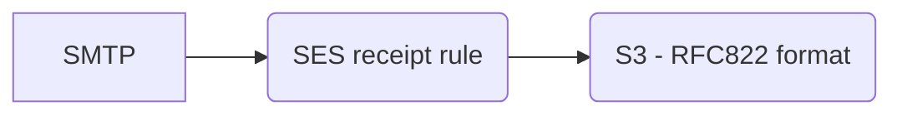
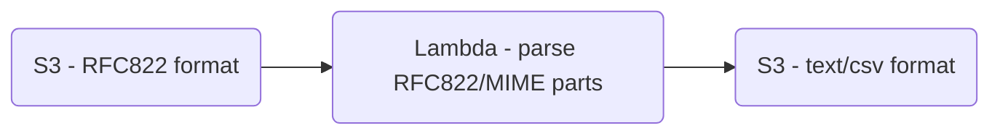

# lambda-email-parser

This is a Lambda function that can be triggered via S3 to parse email RFC822 formatted email messages and extract message MIME parts/attachments into S3. This is a configurable solution so that it can facilitate a variety of use cases.

This article https://aws.amazon.com/premiumsupport/knowledge-center/ses-receive-inbound-emails/ is useful and simply explains how to use SES to receive inbound emails into S3, but it stops short at the common customer challenge of making use of the data. Raw email messages can be a challenge to parse, especially if they are complex MIME structures, or if there is high degree in variability on the sending side. 

Our goal is to simplify and standardize email parsing in a way that is applicable to a variety of use cases. For example, say the objective it to allow customers to send csv attachments into an S3 bucket via email. Assuming the messages are already being injested into an S3 bucket using the above solution, the next step is to add another Lambda function to be triggered.

If the messages are being sent to Workmail and you want to do this parsing with a Workmail Email Flow Rule, then this solution will handle the injestion of RFC822/MIME messages into S3. https://github.com/aws-samples/amazon-workmail-lambda-templates/tree/master/workmail-hello-world-python  Naturally the Lambda functions could be merged into a single function (future enhancement)

This solution gives flexibility to the customer to allow for all MIME parts to be extracted, and it is configurable to only extract specific types of MIME parts. It can save the body of the message, and it can be configured to save header field values. All of this information can subsequently be stored in S3 as a data lake.

Other example use cases may include the following. Follow-up solutions for these use cases TBD.
- AWS as a solution for email journaling for archiving, backups, ediscovery, compliance, forensic research, etc. 
- Processing DMARC reports for analysis.

