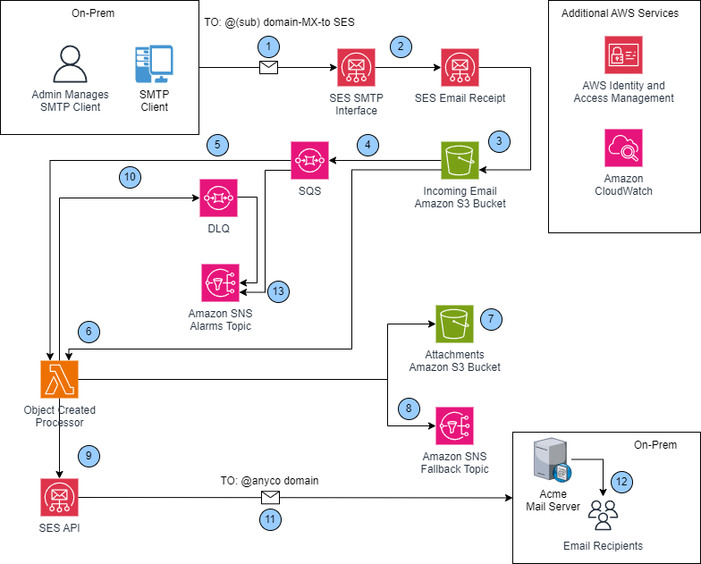
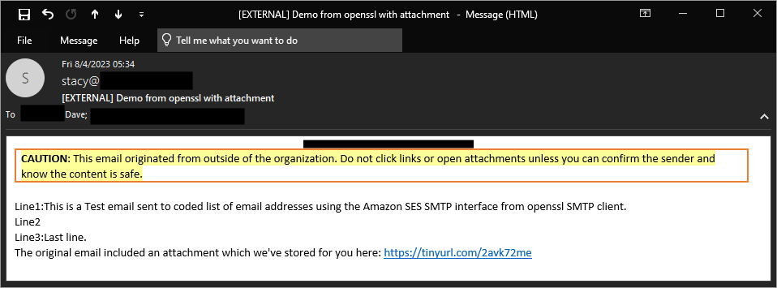

# Serverless IoT email capture, attachment processing, and distribution

Many customers need to automate email notifications to a broad and diverse set of email recipients, sometimes from a
sensor
network with a variety of monitoring capabilities. Many sensor monitoring software products include an SMTP client to
achieve this goal. However, managing email server infrastructure requires specialty expertise to operate and operating
an email server comes with additional cost and inherent risk of breach, spam, and storage management. Organizations also
need to manage distribution of attachments, which could be large and potentially contain exploits or viruses. For IoT
use
cases diagnostic data relevance quickly expires, necessitating retention policies to regularly delete content.

## Solution Overview

This solution uses the Amazon Simple Email Service (SES) SMTP interface to receive SMTP client messages, and processes
the
message to replace an attachment with a pre-signed URL in the resulting email to its intended recipients. Attachments
are
stored separately in an AWS S3 bucket with a lifecycle policy implemented. This reduces the storage requirements of
recipient email server receiving notification emails. Additionally, this solution leverages built-in anti-spam and
security
scanning capabilities to deal with spam and potentially malicious attachments while at the same time providing the
mechanism by which pre-signed attachment links can be revoked should the emails be distributed to unintended recipients.



### The solution uses:

- AWS Simple Email Service (SES) SMTP interface to receive incoming emails.
- AWS SES receipt rule on a (sub)domain controlled by administrators, to store raw incoming emails in an Amazon S3
  bucket.
- AWS Lambda function, triggered on S3 ObjectCreated event, to process raw emails, extract attachments, replace them
  with pre-signed URL with configurable expiry, and send the processed emails to intended recipients.

### Solution Flow Details:

1. SMTP client transmits email content to an email address in a (sub) domain with MX record set to Amazon SES service’s
   regional endpoint.
2. Amazon SES SMTP interface receives email and forwards it to SES Receipt Rule(s) for processing.
3. A matching Amazon SES Receipt Rule saves incoming email into an Amazon S3 Bucket.
4. Amazon S3 Bucket emits an S3 ObjectCreated Event, and places the event onto the SQS queue.
5. The Lambda service polls the inbound messages' SQS queue and feeds them to the Lambda function.
6. The Lambda function, retrieves email files from the S3 bucket, parses the email sender/subject/body, saves attachments to a separate attachment S3 bucket (7), and replaces attachments with pre-signed URLs in the email body. The Lambda function then extracts intended recipient addresses from the email body. If the body contains properly formatted recipients list, email is then sent using AWS SES API (9), otherwise a notice is posted to a fallback Amazon SNS Topic (8).
7. The Lambda function saves extracted attachments, if any, into an attachments bucket.
8. Malformed email notifications are posted to a fallback Amazon SNS Topic.
9. The Lambda function invokes Amazon SES API to send the processed email to all intended recipient addresses.
10. If the Lambda function is unable to process email successfully, the inbound message is placed on to the dead-letter queue (DLQ) SQS queue for later intervention by the operator.
11. SES delivers an email to each recipients’ mail server.
12. Intended recipient(s) downloads the email from the corporate mail server and retrieve attachments from the S3
    pre-signed URL(s) embedded in the email body.
13. An alarm is triggered and a notification is published to Amazon SNS Alarms Topic whenever:
    1. Number of messages in DLQ exceeds 50 messages - threshold for failed messages.
    2. Oldest message on incoming SQS queue is older than 3 minutes - unable to keep up with inbound messages (flooding).
    3. Number of messages on incoming SQS queue in past 5 minutes exceeds 180 (configurable) - traffic exceeds the norm.

## Setting up AWS SES

For this solution you will need an email account where you can receive emails. You’ll also need a (sub)domain for which
you control the [mail exchanger (MX) record](https://docs.aws.amazon.com/ses/latest/dg/receiving-email-mx-record.html).
You can obtain your (sub)domain either
from [AWS Route53](https://docs.aws.amazon.com/Route53/latest/DeveloperGuide/CreatingHostedZone.html) or another domain
hosting provider.

### Verify the sender email address

You’ll need to follow the instructions to Verify an email address for all identities that you use as "From", "Source", "
Sender", or "Return-Path" addresses. You’ll also need to follow these instructions for any identities you wish to send
emails to during initial testing while your SES account is in the "Sandbox" (see next "Moving out of the SES Sandbox"
section).

### Moving out of the SES Sandbox

Amazon SES accounts are “in the Sandbox” by default, limiting email sending only to verified identities. AWS does this
to prevent fraud and abuse as well as protecting your reputation as an email sender. When your account leaves the
Sandbox, SES can send email to any recipient, regardless of whether the recipient's address or domain is verified by
SES. However, you still have to verify all identities that you use as "From", "Source", "Sender", or "Return-Path"
addresses.
Follow the [Moving out of the SES Sandbox](https://docs.aws.amazon.com/ses/latest/dg/request-production-access.html)
instructions in the [SES Developer Guide](https://docs.aws.amazon.com/ses/latest/dg/). Approval is usually within 24
hours.

### Set up the SES SMTP interface

Follow
the [workshop lab instructions](https://catalog.workshops.aws/build-with-simple-email-service/en-US/lab-2/lab-2-1) to
set up email sending from your SMTP client using the SES SMTP interface. Once you’ve completed this step, your SMTP
client can open authenticated sessions with the SES SMTP interface and send emails. The workshop will guide you through
the following steps:

1. Create SMTP credentials for your SES account.
   - **IMPORTANT**: Never share SMTP credentials with unauthorized individuals. Anyone with these credentials can send
     as many SMTP requests and in whatever format/content they choose. This may result in end-users receiving emails
     with unauthorized content, administrative/operations overload, and unbounded AWS charges. Customers can use  [AWS Systems Manager Parameter Store](https://docs.aws.amazon.com/systems-manager/latest/userguide/systems-manager-parameter-store.html)  to protect secrets like SMTP credentials and share them across their team of trusted administrators.

2. Test your connection to ensure you can send emails.
3. Authenticate using the SMTP credentials generated in step 1 and then send a test email from an SMTP client.

### Verify your email domain and bounce notifications with Amazon SES

In order to replace email attachments with a pre-signed URL and other application logic, you’ll need to set up SES to
receive emails on a domain or subdomain you control.

1. [Verify the domain](https://docs.aws.amazon.com/ses/latest/DeveloperGuide/verify-domain-procedure.html) that you want
   to use for receiving emails.
2. [Publish a mail exchanger record (MX record)](https://docs.aws.amazon.com/ses/latest/dg/receiving-email-mx-record.html)
   and include the Amazon SES
   inbound [receiving endpoint](https://docs.aws.amazon.com/general/latest/gr/ses.html#ses_regiom) for your AWS region (
   e.g. [inbound-smtp.us-east-1.amazonaws.com](http://inbound-smtp.us-east-1.amazonaws.com/) for US East Northern
   Virginia) in the domain DNS configuration.
3. Amazon SES automatically manages the bounce notifications whenever recipient email is not deliverable. Follow
   the [Set up notifications for bounces and complaints](https://aws.amazon.com/blogs/messaging-and-targeting/amazon-ses-set-up-notifications-for-bounces-and-complaints/)
   guide to setup bounce notifications.

## Deploying the solution

The solution is implemented using AWS CDK with Python. First clone the
solution [repository](https://gitlab.aws.dev/tfc-ngde-pod-q4-2023-thurs-t5/ngde-ses-capstone) to your local machine or
Cloud9 development environment.
Then deploy the solution by entering the following commands into your terminal:

```sh
python -m venv .venv
. ./venv/bin/activate
pip install -r requirements.txt

cdk deploy \
--context SenderEmail=<verified sender email> \
 --context RecipientEmail=<recipient email address> \
 --context ConfigurationSetName=<configuration set name>
```

**Note**: 

The `RecipientEmail` CDK context parameter in the **cdk deploy** command above can be any email address in the domain you
verified as part of
the [Verify the domain](https://docs.aws.amazon.com/ses/latest/DeveloperGuide/verify-domain-procedure.html) step. In
other words, if the verified domain is acme-corp.com, then the emails can be user@mail.acme-corp.com,
user@acme-corp.com, etc.

The `ConfigurationSetName` CDK context can be obtained by navigating to [Identities](https://console.aws.amazon.com/ses/home#/identities) in AWS SES console, selecting
the verified domain (same as above), switching to "Configuration set" tab and selecting name of the "Default configuration set"

After deploying the solution, please, navigate to Amazon
SES [Email receiving](https://console.aws.amazon.com/ses/home#/email-receiving) in AWS console, edit the rule set and
set it to **Active**.

## Testing the solution end-to-end

Create a small file and generate a base64 encoding so that you can attach it to an SMTP message:

```sh
echo content >> demo.txt
cat demo.txt | base64 > demo64.txt
cat demo64.txt
```

Install openssl (which includes an SMTP client capability) using the following command:

```sh
sudo yum install openssl
```

Now run the SMTP client (openssl is used for the proof of concept, be sure to complete the steps in
the [workshop lab instructions](https://catalog.workshops.aws/build-with-simple-email-service/en-US/lab-2/lab-2-1)
first):

```sh
openssl s_client -crlf -quiet -starttls smtp -connect email-smtp.<aws-region>.amazonaws.com:587
```

and feed in the commands (replacing the brackets [] and everything between them) to send the SMTP message with the
attachment you created.

```sh
EHLO amazonses.com
AUTH LOGIN
[base64 encoded SMTP user name]
[base64 encoded SMTP password]
MAIL FROM:[VERIFIED EMAIL IN SES]
RCPT TO:[VERIFIED EMAIL WITH SES RECEIPT RULE]
DATA
Subject: Demo from openssl
MIME-Version: 1.0
Content-Type: multipart/mixed;
 boundary="XXXXboundary text"

This is a multipart message in MIME format.

--XXXXboundary text
Content-Type: text/plain

Line1:This is a Test email sent to coded list of email addresses using the Amazon SES SMTP interface from openssl SMTP client.
Line2:Email_Rxers_Code:[ANYUSER1@DOMAIN_A,ANYUSER2@DOMAIN_B,ANYUSERX@DOMAIN_Y]:Email_Rxers_Code:
Line3:Last line.

--XXXXboundary text
Content-Type: text/plain;
Content-Transfer-Encoding: Base64
Content-Disposition: attachment; filename="demo64.txt"
Y29udGVudAo=
--XXXXboundary text
.
QUIT
```

**Note**:
For base64 SMTP username and password above, use values obtained in **Set up the SES SMTP interface**, step 1a.
So for example, if the username is **AKZB3LJAF5TQQRRPQZO1**, then you can obtain base64 encoded value using following
command:

```sh
echo -n AKZB3LJAF5TQQRRPQZO1 |base64
QUtaQjNMSkFGNVRRUVJSUFFaTzE=
```

This makes base64 encoded value **QUtaQjNMSkFGNVRRUVJSUFFaTzE=**
Repeat same process for SMTP username and password values in above email.

The openssl command should result in successful authentication an SMTP send messages. Then you should receive an email
that looks like this:



## Optimizing Security of the Solution

1. Do not share DNS credentials. Unauthorized access can lead to domain control, potential denial of service, and AWS charges. Restrict access to authorized personnel only.

2. Do not set the SENDER_EMAIL environment variable to the email address associated with the receipt rule. This address is a closely guarded secret, known only to administrators, and should be changed frequently. Exercise discretion to maintain security.

3. Review access to your code repository regularly to ensure there are no unauthorized changes to your code base. 

4. Utilize Permissions Boundaries to restrict the actions permitted by an IAM user or role. 


## Cleanup

To clean up, start by navigating to Amazon
SES [Email receiving](https://console.aws.amazon.com/ses/home#/email-receiving) in AWS console, and setting the rule set
to **Inactive**.

Once completed, delete the stack:

```sh
cdk destroy
```

### Clean UP AWS SES Access Credentials
In [AWS SES Console](https://console.aws.amazon.com/ses/home?#/smtp), select *Manage existing SMTP credentials*, select
the username for which credentials were created in *Set up the SES SMTP interface* above, navigate to the *Security credentials*
tab and in the *Access keys* section, select *Action* -> *Delete* to delete AWS SES access credentials.

## Troubleshooting

If you are not receiving the email or email is not being sent correctly there are a number of common causes of these
errors:

- 554 Message rejected: Email address is not verified. The following identities failed the check in
  region <region>: <email address>
  - This means that you have attempted to send an email from address that has not been verified.
  - Please, ensure that the "MAIL FROM:[VERIFIED EMAIL IN SES]" email address sent to openssl matches
    the `SenderEmail=<verified sender email>` email address used in cdk deploy.
  - Also make sure this email address was used in **Verify the sender email address** step.
- Email is not being delivered/forwarded
  - The incoming S3 bucket under the **incoming** prefix, contains file called **AMAZON_SES_SETUP_NOTIFICATION**. This
    means that MX record of the domain setup is missing. Please, validate that the MX record (step 2) of **Verify your
    email domain with Amazon SES to receive emails** section is fully configured.
  - Please ensure that after deploying the Amazon SES solution, the created rule set was made active by navigating to
    Amazon SES [Email receiving](https://console.aws.amazon.com/ses/home#/email-receiving) in AWS console, and set it
    to **Active**.
  - This may mean that the destination email address has bounced. Please, navigate to Amazon
    SES [Suppression list](https://console.aws.amazon.com/ses/home#/suppression-list) in AWS console ensure that
    recipient’s email is not in the suppression list. If it is listed, you can see the reason in the “Suppression
    reason” column. There you may either manually remove from the suppression list or if the recipient email is not
    valid, consider using a different recipient email address.
