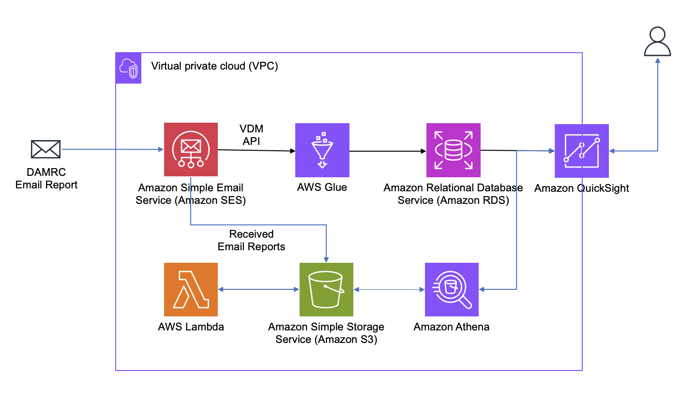

# vdm-to-quicksight

## Building Amazon SES deliverability and DMARC dashboard with Amazon QuickSight

Amazon Simple Email Service (Amazon SES) enables high-volume email delivery. There are multiple methods to monitor sending and delivery metrics, such as event logging. However, event logging can become costly at extremely high email volumes. Each email generates a minimum of two events with each event being approximately 1.7 KB in size. For a customer sending 10 million emails per day, this could generate over 1 terabyte of event data per month.

The Virtual Deliverability Manager (VDM) is an add-on feature for Amazon SES that provides high-level metrics and insights into email deliverability. The VDM UI is accessible through the AWS Management Console. However, some customers may want to provide similar metrics and visualizations to users without AWS console access.

## Solution Overview

The proposed architecture utilizes Amazon Glue, Amazon RDS MySQL, and Amazon QuickSight to provide similar insights to the AWS Console's VDM without requiring IAM access. Amazon Glue jobs query the VDM API daily and store the summarized data in an Amazon RDS MySQL database. Amazon QuickSight connects and visualizes the insights, delivering an alternative approach to gain visibility into deliverability metrics without direct console access.

Included in this example is deliverability metrics from DMARC reports, received by email. SES automatically receives the emails, stores them in S3 and triggers a lambda function to process report attachments. Prepared data is stored in S3 and made available in Amazon Athena to be enhance the VDM metrics. Two datasets are combined into a single QuickSight dashboard consolidating and aligning metrics from both internal SES deliverability metrics as well as from public internet reputation.  Visualizations can be further customized to show historical data with various filters such as domain name, IP address and date ranges.

()
